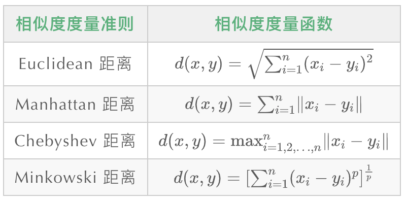
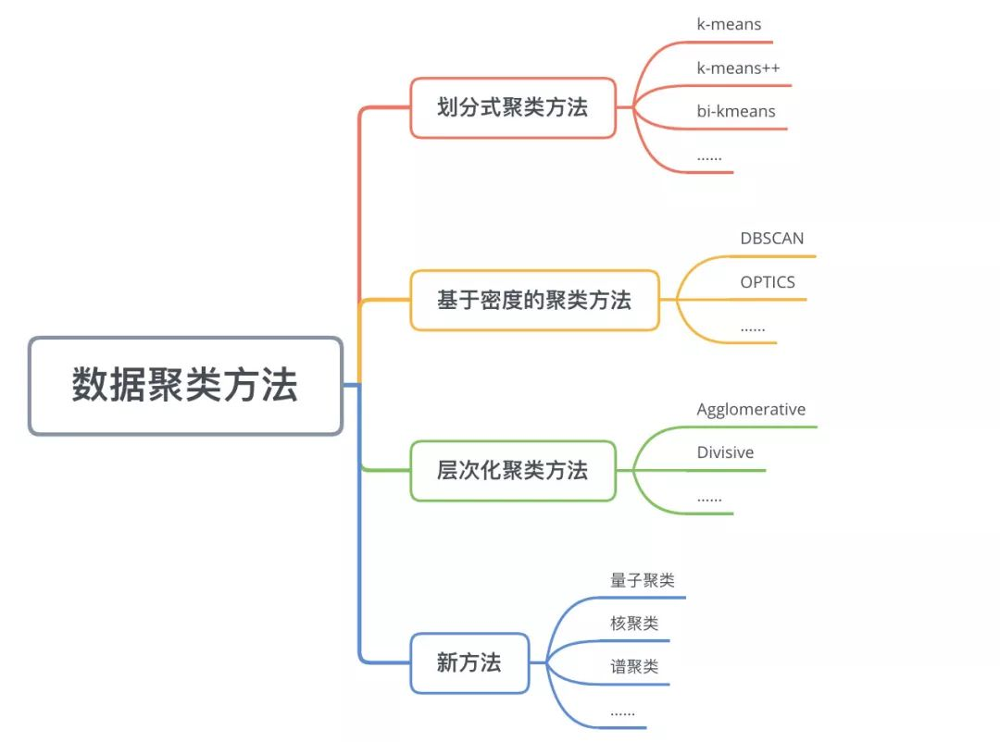
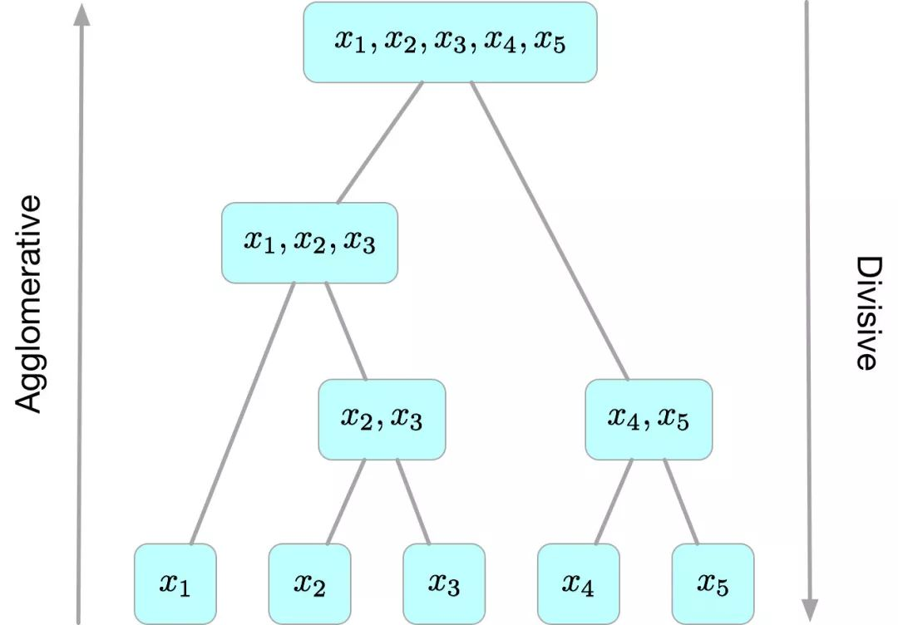

## 一、基本概念

### 定义

`聚类(Clustering)`是按照某个特定标准(如距离)把一个数据集分割成不同的类或簇，使得 **同一个簇内的数据对象的相似性尽可能大，同时不在同一个簇中的数据对象的差异性也尽可能地大** 。也即聚类后同一类的数据尽可能聚集到一起，不同类数据尽量分离。

更通俗的解释，“**物以类聚，人以群分**”，很多东西都可以按照彼此之前的相似程度划分为一类，如有下列几个实物，`[狗，猫，猴子，土豆、番茄、汽车、自行车]`，显然，这几个东西可以分为“动物”、“植物”、“汽车”三类，这些实物没有标签，却也可以对其划分，聚类就是教会机器自动对这些没有标签的实物进行分类。

### 与分类的区别

* `聚类(Clustering)`：是指把相似的数据划分到一起，具体划分的时候并不关心这一类的标签，目标就是把相似的数据聚合到一起，聚类是一种`无监督学习(Unsupervised Learning)`方法。
* `分类(Classification)`：是把不同的数据划分开，其过程是通过训练数据集获得一个分类器，再通过分类器去预测未知数据，分类是一种`监督学习(Supervised Learning)`方法。

### 聚类的一般过程

1. 数据准备：特征标准化和降维
2. 特征选择：从最初的特征中选择最有效的特征，并将其存储在向量中
3. 特征提取：通过对选择的特征进行转换形成新的突出特征
4. 聚类：基于某种距离函数进行相似度度量，获取簇
5. 聚类结果评估：分析聚类结果，如`距离误差和(SSE)`等

### 数据对象间的相似度度量

对于数值型数据，可以使用下表中的相似度度量方法。



### cluster之间的相似度度量

除了需要衡量对象之间的距离之外，有些聚类算法（如层次聚类）还需要衡量`cluster`之间的距离 ，假设`Ci`和`Cj`为两个 `cluster`，则前四种方法定义的`Ci`和`Cj`之间的距离如下表所示：


* `Single-link`定义两个`cluster`之间的距离为两个`cluster`之间距离最近的两个点之间的距离，这种方法会在聚类的过程中产生`链式效应`，即有可能会出现非常大的`cluster`
* `Complete-link`定义的是两个`cluster`之间的距离为两个``cluster`之间距离最远的两个点之间的距离，这种方法可以避免`链式效应`,对异常样本点（不符合数据集的整体分布的噪声点）却非常敏感，容易产生不合理的聚类
* `UPGMA`正好是`Single-link`和`Complete-link`方法的折中，他定义两个`cluster`之间的距离为两个`cluster`之间所有点距离的平均值
* 最后一种`WPGMA`方法计算的是两个 `cluster` 之间两个对象之间的距离的加权平均值，加权的目的是为了使两个 `cluster` 对距离的计算的影响在同一层次上，而不受 `cluster` 大小的影响，具体公式和采用的权重方案有关。

## 二、聚类算法

数据聚类方法主要可以分为`划分式聚类方法(Partition-based Methods)`、`基于密度的聚类方法(Density-based methods)`、`层次化聚类方法(Hierarchical Methods)`等



下文仅对`K-means`、`层次聚类`做简单介绍，详细原理请**自行查阅**相关资料

### k-means算法

经典的`k-means`算法的流程如下：

> 1. 创建个点作为初始质心(通常是随机选择)
> 2. 当任意一个点的簇分配结果发生改变时
>
>     1. 对每个质心
>     2. 将数据点分配到距其最近的簇
>     3. 计算质心与数据点之间的距离
>     4. 对数据集中的每个数据点
>     5. 对每个簇，计算簇中所有点的均值并将均值作为质心
>

经典`k-means`源代码，下左图是原始数据集，通过观察发现大致可以分为4类，所以取k=4，测试数据效果如下右图所示。


一般来说，经典`k-means`算法有以下几个特点：

1. 需要提前确定值
2. 对初始质心点敏感
3. 对异常数据敏感

### 层次聚类

**层次聚类算法 (hierarchical clustering)** 将数据集划分为一层一层的 `clusters`，后面一层生成的 `clusters` 基于前面一层的结果。层次聚类算法一般分为两类：

* **Agglomerative 层次聚类** ：又称自底向上（bottom-up）的层次聚类，每一个对象最开始都是一个 `cluster`，每次按一定的准则将最相近的两个 `cluster` 合并生成一个新的 `cluster`，如此往复，直至最终所有的对象都属于一个 `cluster`。这里主要关注此类算法。
* **Divisive 层次聚类** ：又称自顶向下（top-down）的层次聚类，最开始所有的对象均属于一个 `cluster`，每次按一定的准则将某个 `cluster` 划分为多个 `cluster`，如此往复，直至每个对象均是一个 `cluster`。



### 评价指标

由于数据以及需求的多样性，没有一种算法能够适用于所有的数据类型、数 据簇或应用场景，似乎每种情况都可能需要一种不同的评估方法或度量标准。例 如，K均值聚类可以用误差平方和来评估，但是基于密度的数据簇可能不是球形， 误差平方和则会失效。在许多情况下，判断聚类算法结果的好坏强烈依赖于主观解释。

聚类算法的评价指标常见的有以下几种，原理部分请自行查阅相关资料

* 兰德指数

* 互信息的得分

* 同质性，完整性和 V-measure

## 三、代码讲解

聚类算法从0造轮子难度还是很大的，因而此次仍然以`sklearn`包下的聚类算法进行讲解，主要学会使用，在此基础上理解里面参数的含义；

语料仍为上次文本分类所使用的语料

导入本次需要使用的库

```python
from mpl_toolkits.mplot3d import Axes3D
from sklearn.feature_extraction.text import TfidfTransformer
from sklearn.feature_extraction.text import CountVectorizer
from sklearn.cluster import KMeans
from sklearn.cluster import AgglomerativeClustering
import matplotlib.pyplot as plt
from scipy.spatial.distance import cdist
import numpy as np
import pandas as pd
from sklearn.manifold import TSNE
from sklearn.decomposition import PCA
from sklearn import metrics
from collections import Counter
```

### K-Means实现

#### 1.特征提取

这一步和上一次任务相同，也就是文本向量化

```python
    def tf_idf_vector(self):
        data = pd.read_csv(self.corpus).iloc[:10000]
        corpus_train = data['文本分词'].values.tolist()
        self.labels = data['分类'].values.tolist()
        print(corpus_train[:10])
        count_v1 = CountVectorizer(max_df=0.4, min_df=0.01)
        counts_train = count_v1.fit_transform(corpus_train)
        word_dict = {}
        for index, word in enumerate(count_v1.get_feature_names()):
            word_dict[index] = word
        print(repr(counts_train.shape))
        tf_idf_transformer = TfidfTransformer()
        tf_idf_train = tf_idf_transformer.fit(counts_train).transform(counts_train)
        return tf_idf_train, word_dict
```

#### 2.算法实现

直接调用k-means函数，对数据进行拟合

```python
    # k-means聚类函数
    def cluster_k_means(self, tf_idf_train, word_dict, cluster_docs, cluster_keywords, num_clusters):
        f_docs = open(cluster_docs, 'w+')
        km = KMeans(n_clusters=num_clusters)
        km.fit(tf_idf_train)
        clusters = km.labels_.tolist()
        cluster_dict = {}
        order_centroids = km.cluster_centers_.argsort()[:, ::-1]
        doc = 1
        for cluster in clusters:
            f_docs.write(str(str(doc)) + ',' + str(cluster) + '\n')
            doc += 1
            if cluster not in cluster_dict:
                cluster_dict[cluster] = 1
            else:
                cluster_dict[cluster] += 1
        f_docs.close()
        cluster = 1
        f_cluster_words = open(cluster_keywords, 'w+')
        for ind in order_centroids:
            words = []
            for index in ind[:50]:
                words.append(word_dict[index])
            print(cluster, (','.join(words)))
            f_cluster_words.write(str(cluster) + '\t' + ','.join(words) + '\n')
            cluster += 1
            print('******' * 5)
        f_cluster_words.close()

	 # 评价
        labels_pred = self.trans(self.labels, clusters)
        self.eval(tf_idf_train, km, self.labels, labels_pred)
```

#### 3.评价

```python
    # 聚类评价
    def eval(self, tf_idf_train, km, labels_true, labels_pred):
        """1、无label_true"""
        print('轮廓系数评价:', metrics.silhouette_score(tf_idf_train.todense(), km.labels_))
        print("CH分数:", metrics.calinski_harabasz_score(tf_idf_train.todense(), km.labels_))
        print("戴维森堡丁指数:", metrics.davies_bouldin_score(tf_idf_train.todense(), km.labels_))

        """2、有label_true"""
        print("兰德系数:", metrics.adjusted_rand_score(labels_true, labels_pred))
        print("互信息:", metrics.adjusted_mutual_info_score(labels_true, labels_pred))
        print("V-measure:", metrics.v_measure_score(labels_true, labels_pred))

    @staticmethod
    def trans(label_true, label_predict):
        sort_true = dict(Counter(label_true).most_common())
        sort_predict = dict(Counter(label_predict).most_common())
        dict_refer = {}
        for x, y in zip(sort_true, sort_predict):
            dict_refer[y] = x
        trans_list = [dict_refer[item] for item in label_predict]
        return trans_list
```

#### 4.可视化

聚类有一个好玩的地方就是可视化，也就是上述那些散点图

```python
    def visualization(self, tf_idf_train, km):
 
        pca = PCA(n_components=3)
        tf_idf_weight = tf_idf_train.toarray()

        '''三维展示'''
        embedded = pca.fit_transform(tf_idf_weight)
        x_min, x_max = np.min(embedded, 0), np.max(embedded, 0)
        embedded = embedded / (x_max - x_min)
        fig = plt.figure()
        ax = Axes3D(fig)
        ax.scatter(embedded[:, 0], embedded[:, 1], embedded[:, 2], c=km.labels_)

        fig.set_tight_layout(False)
        plt.show()
        # plt.savefig('fig.png', bbox_inches='tight')

        '''二维展示'''
        tsne = TSNE(n_components=2)
        decomposition_data = tsne.fit_transform(tf_idf_weight)
        x = []
        y = []

        for i in decomposition_data:
            x.append(i[0])
            y.append(i[1])
        fig = plt.figure(figsize=(10, 10))
        ax = plt.axes()
        plt.xlabel('X')
        plt.ylabel('Y')
        plt.title('K-means clustering')
        cValue = ['r', 'y', 'g', 'b', 'r', 'y']
        plt.scatter(x, y, c=km.labels_, marker=".")
        plt.xticks(())
        plt.yticks(())
        plt.show()
        # plt.savefig('./sample.png', aspect=1)
```

### 层次聚类实现

层次聚类与上述基本一致，主要是聚类函数的变化

#### 算法

```python
    # 层次聚类
    def AgglomerativeCluster(self, X, num_clusters):
        clustering = AgglomerativeClustering(n_clusters=num_clusters, affinity='euclidean', memory=None,
                                             connectivity=None, compute_full_tree='auto', linkage='ward',
                                             distance_threshold=None)
        # 模型拟合
        clustering.fit(X.todense())
        # print(clustering.labels_)
        # 画聚类图
        # visualization(X, clustering)
        # 评价
        labels_pred = self.trans(self.labels, clustering.labels_.tolist())
        self.eval(X, clustering, self.labels, labels_pred)

	# 因画树形图时聚类参数不可设置，故在此注释掉
    	# plt.title('树状图')
    	# plot_dendrogram(clustering, truncate_mode='level', p=3)
    	# plt.xlabel("Number of points in node (or index of point if no parenthesis).")
    	# plt.show()

```

#### 可视化

层次聚类也可对结果进行上述二维或者三维的可视化展示，除此之外也有一个特殊的`树形图`

```python
# 树状图展示
def plot_dendrogram(model, **kwargs):
    counts = np.zeros(model.children_.shape[0])
    n_samples = len(model.labels_)
    for i, merge in enumerate(model.children_):
        current_count = 0
        for child_idx in merge:
            if child_idx < n_samples:
                current_count += 1
            else:
                current_count += counts[child_idx - n_samples]
        counts[i] = current_count

    linkage_matrix = np.column_stack([model.children_, model.distances_,
                                      counts]).astype(float)
    dendrogram(linkage_matrix, **kwargs)


```

需注意，画树状图时聚类参数不可设置，因而使用时需要对`AgglomerativeClustering`内参数进行调整，这里不演示，作为本次作业之一

## 四、任务

### 说明

聚类算法本次介绍较为简略，还是有很多内容没有涉及，且都是以“使用”为目的，更多底层原理需要自己去查阅资料；

### 提交文件

1. `Cluster.py`：聚类代码文件，且对函数进行必要注释
2. `聚类图5张`：其中k-means聚类包括二维图和三维图两张，层次聚类包括二维图、三维图及树形图
3. `eval.txt`：两个算法的评价数值，需对上述`eval函数`进行一点改动
4. `题目.md`：回答下列问题

    1. 对文本向量化（TF-IDF算法）表示后，如何计算两个句子之间的相似度？或者换个说法，有哪些算法或公式？
    2. 余弦距离如何计算，如`a = [1.3, 5.7, 9.1, 11.2] ` `b = [0.4, 6.8, 5.4, 7.2]`
    3. 可视化里使用了哪些降维方法？并找一找除了这些方法的其它方法
    4. K-means里的k应该如何选择，也就是聚类的簇数除了随机选择或人工判断外，有没有其它什么办法？
