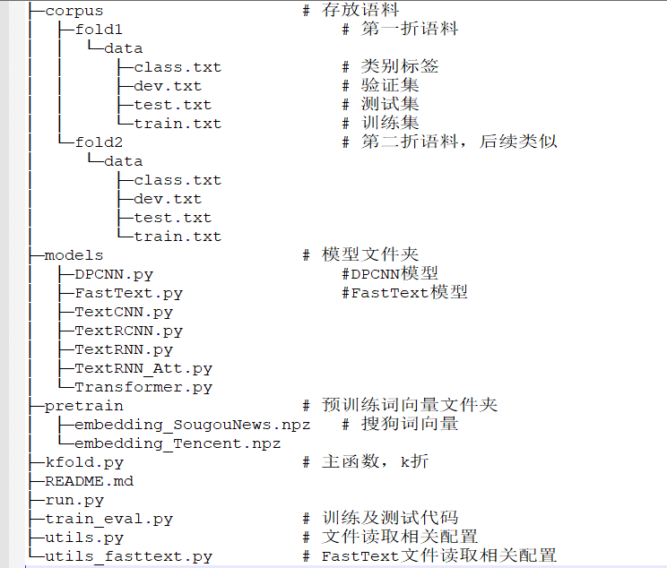
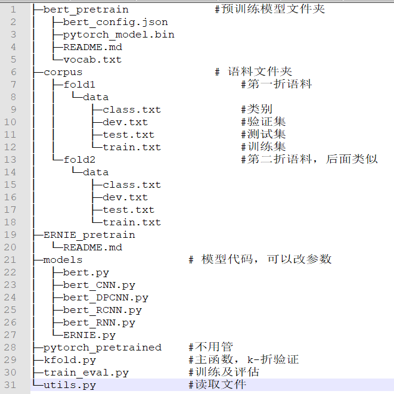
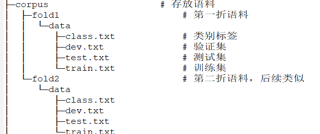
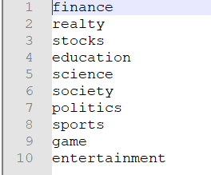

具体代码：[veigaran/NLP_ROAD (github.com)](https://github.com/veigaran/NLP_ROAD)

## 前言

上一次对深度学习下的文本分类做了简单的介绍，代码部分都没有讲，都是直接让大家看那俩github仓库；这个开源的代码在文本分类上实现的非常好了，深度神经网络都包括了，而且使用很简单。

但是，仍然有一些地方可以改进，比如增加十折训练，更换更好的词向量，评价指标输出到文件等，所以我在那俩仓库基础上进行一定的修改，增强实用性；同时对代码结构做一个简单的说明

## 代码结构

### CNN、RNN



### BERT



## 使用方式

对文件结构大致了解后，就开始学一下怎么用；

### step1：处理语料

此模型的输入文件格式是

```python
格式：句子\t标签

如：
体验2D巅峰 倚天屠龙记十大创新概览	8
60年铁树开花形状似玉米芯(组图)	5
同步A股首秀：港股缩量回调		2
中青宝sg现场抓拍 兔子舞热辣表演	8
```

如何处理就不多说了，难度不大；最终分为训练集、验证集、测试集，比例可以为8:1:1，放在corpus/folder下；因为要十折，所以10个文件夹，这里就放了2个，其余的类似；



另外还有一个`class.txt`,这个是对应的标签，也需要根据自己**需要进行更改**



### step2：下载预训练模型

**Word2Vec模型**

CNN、RNN、FastText这些模型要使用到，可以自己训练也可以下载公开的

word2vec模型汇总：[Embedding/Chinese-Word-Vectors:上百种预训练中文词向量 ](https://github.com/Embedding/Chinese-Word-Vectors)

具体的参考这个仓库，里面有很多个训练好的Word2Vec模型，在后续的分类里我使用的是基于百度百科训练得到的模型，直接下载下来格式有点不一致，还需要进行转换，我已经转换好了，可以看服务器以下路径

```python
/home/NjauModelTask/LiuHuan/classfication/CNNRNN/pretrain/baidu.npy
```

直接复制就行；

**BERT模型**

bert模型放在 bert_pretain目录下，ERNIE模型放在ERNIE_pretrain目录下，每个目录下都是三个文件：

* pytorch_model.bin
* bert_config.json
* vocab.txt

预训练模型可以去[huggingface](https://huggingface.co/)上下载；

也可以直接看服务器下列路径，直接复制

```python
/home/NjauModelTask/LiuHuan/classfication/Bert/bert_pretrain
```

### step3：训练

这里和原仓库没啥区别，就是文件名改一下

**CNN、RNN**

```shell
# 训练并测试：
# TextCNN
python kfold.py --model TextCNN

# TextRNN
python kfold.py --model TextRNN

# TextRNN_Att
python kfold.py --model TextRNN_Att

# TextRCNN
python kfold.py --model TextRCNN

# FastText, embedding层是随机初始化的
python kfold.py --model FastText --embedding random 

# DPCNN
python kfold.py --model DPCNN

# Transformer
python kfold.py --model Transformer
```

**BERT**

```shell
# 训练并测试：
# bert
python kfold.py --model bert

# bert + 其它
python kfold.py --model bert_CNN

# ERNIE
python kfold.py --model ERNIE
```

### step4：评估

评估的话，上方已经包括评估了，结果一种方式是在命令行窗口展示，另一个就是我增加了写入本地文件的功能，可以直接打开；每一折的语料在对应文件夹下

文件路径在`corpus/folder/log/modelname/eval.txt`,如

```shell
/CNNRNN/corpus/fold1/log/TextCNN/eval.txt
```

## 改进点

### 词向量

首先回顾一下**任务二**里的文本表示内容，当时说过有多种方式，也即如下

* 基于one-hot、tf-idf、textrank等的bag-of-words；
* 主题模型：LSA（SVD）、pLSA、LDA；
* 基于词向量的静态表征：word2vec、fastText、glove
* 基于词向量的动态表征：elmo、GPT、bert

在任务二、三里使用的是传统的特征表示方式，也即TF-IDF，此方法存在很大的局限性，在神经网络模型里已经不太试用了，故目前多是使用词向量的方式，这里主要说一下`word2vec`和`bert`

#### Word2vec

原始仓库里使用的是搜狗的词向量，那个规模很小，换个语料跑效果估计就不行了，所以这里的改进主要是使用大型的词向量进行替换

原理部分大家自己去找论文、博客看吧，这里不多解释，只需要明白一点，训练完后，每个词语都是一个向量，如下

```python
“狗”表示为  [0.14，…，0.61，……，0.27]
“猫”表示为  [0.18，…，0.71…… ， 0.31]
“机器”表示为[-0.43，…，0.02，……，0.97]
```

利用这个特性就解决了one-hot那种维度爆炸的问题，一般维度多设置为300维；

##### 训练

模型的训练也很简单，传入一个分词后的词表，设置参数，之后保存到本地进行调用

```python
 model = Word2Vec(word_list, min_count=1, vector_size=300,workers=3, window=3, sg=1)
# 保存模型
model.save('my_embedding')
```

一些任务上可以自己训练一个简单的word2vec模型，但是这类模型一个很大的问题在于训练的语料太少，而语料的规模直接影响最终的效果，故实际使用中，选择一些开源的词向量模型是更好的选择

#### BERT

稍微解释一下，BERT模型现在有很多，最开始的`bert-base`，再到`bert-wwm`,`ERINE`等等，都可以叫做BERT，打个比方

> A公司发明了一种新的交通工具，起名叫BERT（假设是汽车），受到很多人的喜爱，之后其它公司在原始基础上改进功能，比如B公司对汽车的发动机改进，发明了新的产品，起名叫ERINE
>
> 但是不管是啥，他们都是在原始BERT基础上改进来的，都可以叫它BERT
>


上面的`word2vec`词向量有一个很大的问题，就是不能解决一词多义，不论在哪个语境，词语的向量都固定了，比如下面这个经典句子

```python
sentenceA：我有一箱苹果和香蕉
sentenceB：他今天刚买了一部苹果手机

```

在`word2vec`里，“苹果”的向量在A句和B句都是一样的，但是在`BERT`里却能够根据语境动态调整词向量，就解决了这个问题；

至于BERT如何获得词向量，如何训练，背后原理等等，参考任务四的说明文档，去找一下相关论文等进行理解；

### 十折交叉

任务二里提及一般为了验证模型效果，不会只跑一次，会对语料进行多次切分验证，至于怎么生成十折语料，这个就是一个简单的文本处理，最简单就是将语料打乱十次，生成10个不同的训练集、测试集、验证集

原仓库只是一次的结果，如果跑十折的话，就得自己更换数据集十次，在输入十次命令行，很麻烦，故对此做了优化，就是一个调用；

此次是用`Python`写的接口，也即`kfold.py`,使用方式见上文；除此之外有很多代码是使用`shell`脚本写的，那个方式也很推荐，这里就不单独写了

### 指标文件

其实没啥改动，就是把评价的结果写入到了txt里，方便查看
